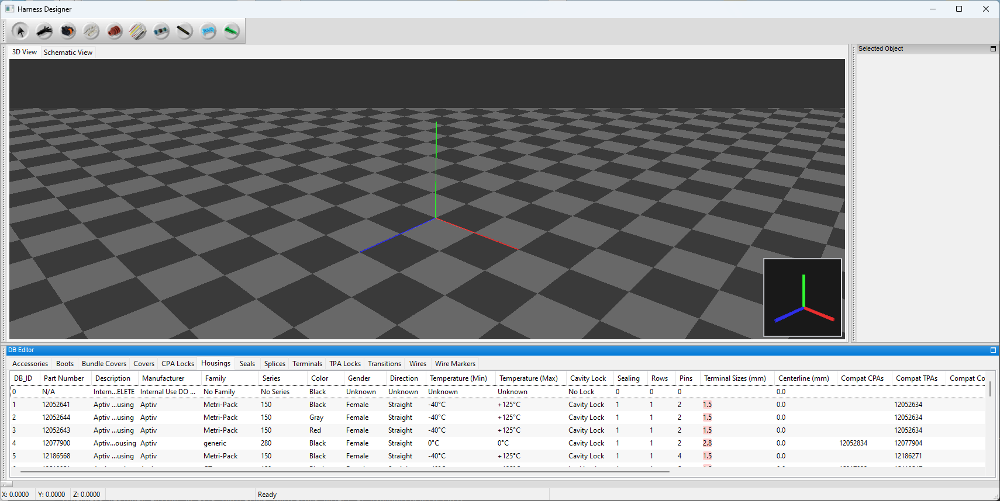
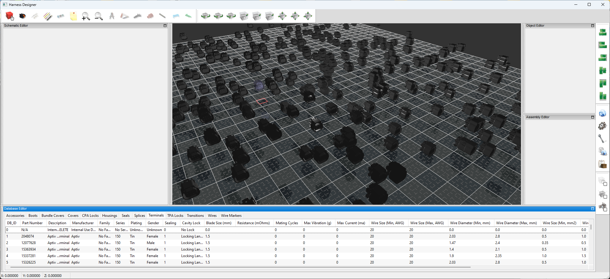

# HarnessDesigner
Wiring Harness design software (WIP)

This project is currently being developed. I don't have a time frame as to when 
it will be completed but I am hoping within the next couple of months maybe sooner.

Here is a preview of the work in progress. I know it doesn't look like much at the 
moment but things are going to start to come together pretty quickly from this point.

 

**UPDATE**: 02/22/2026
I wanted to let anyone that has looked at this repo that I am still working on developing it.
I am actually thinking about putting up a Kickstarter to see if people would be able to help
financially towards the development. I would love to be able to offload things like the artwork
to a person that has more skill in that area than I do. My skill is pretty lacking in that 
department.

 

**UPDATE**: 02/28/2026
Plugging away...

Stress test rendering the following..

* 10,012,800 triangles
* 1,600 quads
* 80 solid lines
* 400 stipple lines (dashed)
* 30,044,800 vertices

There is a total of 480 housings added in this image. With the most recent changes
I have made which were to improve the performance I managed to squeeze out 
142 frames per second with the 3D editor. That is an amazing number considering
this is running using Python code. Moving around is nice and responsive and it's 
smooth as glass with ZERO chattering. I came up with a fantastic system to handle 

 

*Parts*
-------

There will be a database that comes preloaded with 10's of thousands of parts from 
manufcaturers like:

* Aptiv
* Bosch
* TE
* Deutsch
* Molex
* Yazaki

 

Available parts to use

* housings
* terminal pins
* cpa locks
* tpa locks
* boots
* covers
* seals & plugs
* transitions
* shrink tubing
* splices
* wires/cables

Part attributes that are available

* Wire/cable
  * part number
  * manufacturer ¹
  * description
  * family
  * series
  * color
  * max temp rating
  * image
  * datasheet
  * cad
  * additional colors (stripe colors)
  * core material
  * conductor count
  * shielding
  * turns per inch (for twisted pair)
  * conductor diameter (mm)
  * conductor area (mm2 and AWG)
  * outside diameter (mm)
  * weight (grams per meter)
* housing
  * part number
  * manufacturer ¹
  * description
  * family
  * series
  * color
  * minimum temperature
  * maximum temperature
  * image
  * datasheet
  * cad
  * gender
  * wire exit direction
  * length (mm)
  * width (mm)
  * height (mm)
  * weight (grams)
  * cavity lock type
  * sealing
  * row count
  * cavity count
  * pitch
  * compatable cpas
  * compatable tpas
  * compatable covers
  * compatable terminals
  * compatable seals
  * compatable housings (mates to)
  * 2d dxf drawing
  * 3d model (stl or 3mf)
* terminals
  * part number
  * manufacturer ¹
  * description
  * family
  * series
  * plating type
  * image
  * datasheet
  * cad
  * gender
  * sealing
  * cavity lock type
  * terminal size
  * resistance (mOhms)
  * mating cycles
  * max vibration (g)
  * max current (ma)
  * min AWG
  * max AWG
  * min dia (mm)
  * max dia (mm)
  * min cross (mm2)
  * max cross (mm2)
  * weight (grams)
* seals
  * part number
  * manufacturer ¹
  * description
  * series
  * color
  * min temperature
  * max temperature
  * image
  * datasheet
  * cad
  * type (single terminal seal, plug, etc...)
  * hardness (shore)
  * lubricated
  * length
  * outside diamneter (mm) (if applicable)
  * inside diameter (mm) (if applicable)
  * minimum wire diameter (mm)
  * maximum wire diameter (mm)
  * weight (grams)
* tpa locks
  * part number
  * manufacturer ¹
  * description
  * family
  * series
  * color
  * image
  * datasheet
  * cad
  * minimum temperature
  * maximum temperature
  * length (mm)
  * width (mm)
  * height (mm)
  * weight (grams)
  * terminal sizes
  * housing cavity locations
* cpa locks
  * part number
  * manufacturer ¹
  * description
  * family
  * series
  * color
  * image
  * datasheet
  * cad
  * minimum temperature
  * maximum temperature
  * length (mm)
  * width (mm)
  * height (mm)
  * weight (grams)
* covers
  * part number
  * manufacturer ¹
  * description
  * family
  * series
  * color
  * image
  * datasheet
  * cad
  * minimum temperature
  * maximum temperature
  * wire exit direction
  * length (mm)
  * width (mm)
  * height (mm)
  * weight (grams)
* shrink tubing
  * part number
  * manufacturer ¹
  * description
  * series
  * material
  * color
  * rigidity
  * shrink temperature
  * image
  * datasheet
  * cad
  * minimum temperature
  * maximum temperature
  * minimum diameter (mm)
  * maximum diameter (mm)
  * wall type (single, double, etc...)
  * shrink ratio
  * protections
  * adhesive
  * weight (grams)
* transitions
  *  

*Software features*
-------------------

* Schematic editor
* 3D Editor
* BOM generation
* Concentric Twisting
* 3D views of parts (when available)
* Rules
* Circuit numbering and naming
* 
