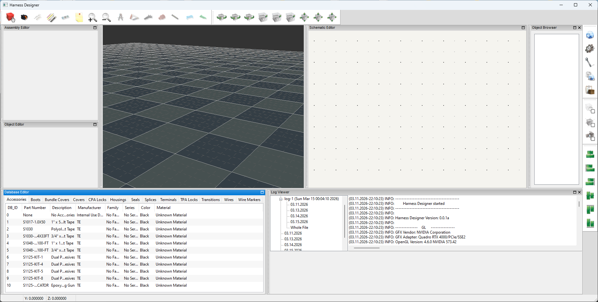

# HarnessDesigner
Wiring Harness design software (WIP)

This project is currently being developed. I don't have a time frame as to when 
it will be completed but I am hoping within the next couple of months maybe sooner.

Photos of the work in progress...

 

 

Latest Additions...

The Schematic Editor is starting to take shape. I am using OpenGL to handle the
rendering for this as well. I have the mouse controls sorted out as well as snap 
to grid and angle snap. The grid properly displays.

I also added a log file manager. I still have to add the ability to delete logfiles.
I did add archiving of the log filesonce they get to a size the user is able to 
define. The user is also able to set the number of archives as well.

Somewhere along the line I seem to have lost the axis indicator. I am going to have 
to add that back in.

Things I still have to do...
* Assembly editor: This is used to create a fully assembled connector. This would 
include terminal pins, seals, CPA locks and TPA locks. Once an assembly is created 
it is going to be able to be used like a traditional part. The assembly will becomes 
exploded into its individual components when it gets added to a project. This allows 
the user to make adjustments in parts that are used without effecting anything else. 
* Buttons and menus: This is fairly self explaniatory.
* adding, removing and manipulating objects in the 3d editor: I have a lot of the 
framework in place and most of it should work. I need to finish up the buttons 
and menus to test it.
* adding, removing and manipulating objects in the schematic editor: This is the 
same deal as the 3d editor, most of he framework is done I simply eed to tie in 
the buttons and menus to be able to test it.
* object browser: This will provide a complete tree of all of the parts and pieces
added to a project. It is written I just have to do more tests on it. 
* object editor: This is going to be a foldable bar type of control that will provide
both iformation about a selected part and also provide the controls to set things like
the position and angle of the object.
* I have to work out a more refined control for adjusting a parts angle. Currently 
there is an arcball style control and there will be manual entry but I would also like 
to provide another mouse type control where there are handles that can be clicked 
and dragged to set the angle. The angle stuff is tricky because the eaiest way for 
a user to interact with angles is by using Euler angles (x, y and z axis) the issue
with using Euler angles is gimbal lock and the part spinning wildly when 2 of the axes
align. This only occurs when converting to Euler angles not from them. But to have the 
manual controls show the correct numbers is where we run into issues. 

Stress test rendering the following..

* 10,012,800 triangles
* 1,600 quads
* 80 solid lines
* 400 stipple lines (dashed)
* 30,044,800 vertices

There is a total of 480 housings added in this image. With the most recent changes
I have made which were to improve the performance I managed to squeeze out 
172 frames per second with the 3D editor. That is an amazing number considering
this is running using Python code. Moving around is nice and responsive and it's 
smooth as glass with ZERO chattering. I came up with a fantastic system to handle 

*Parts*
-------

There will be a database that comes preloaded with 10's of thousands of parts from 
manufcaturers like:

* Aptiv
* Bosch
* TE
* Deutsch
* Molex
* Yazaki

 

Available parts to use

* housings
* terminal pins
* cpa locks
* tpa locks
* boots
* covers
* seals & plugs
* transitions
* shrink tubing
* splices
* wires/cables

Part attributes that are available

* Wire/cable
  * part number
  * manufacturer ¹
  * description
  * family
  * series
  * color
  * max temp rating
  * image
  * datasheet
  * cad
  * additional colors (stripe colors)
  * core material
  * conductor count
  * shielding
  * turns per inch (for twisted pair)
  * conductor diameter (mm)
  * conductor area (mm2 and AWG)
  * outside diameter (mm)
  * weight (grams per meter)
* housing
  * part number
  * manufacturer ¹
  * description
  * family
  * series
  * color
  * minimum temperature
  * maximum temperature
  * image
  * datasheet
  * cad
  * gender
  * wire exit direction
  * length (mm)
  * width (mm)
  * height (mm)
  * weight (grams)
  * cavity lock type
  * sealing
  * row count
  * cavity count
  * pitch
  * compatable cpas
  * compatable tpas
  * compatable covers
  * compatable terminals
  * compatable seals
  * compatable housings (mates to)
  * 2d dxf drawing
  * 3d model (stl or 3mf)
* terminals
  * part number
  * manufacturer ¹
  * description
  * family
  * series
  * plating type
  * image
  * datasheet
  * cad
  * gender
  * sealing
  * cavity lock type
  * terminal size
  * resistance (mOhms)
  * mating cycles
  * max vibration (g)
  * max current (ma)
  * min AWG
  * max AWG
  * min dia (mm)
  * max dia (mm)
  * min cross (mm2)
  * max cross (mm2)
  * weight (grams)
* seals
  * part number
  * manufacturer ¹
  * description
  * series
  * color
  * min temperature
  * max temperature
  * image
  * datasheet
  * cad
  * type (single terminal seal, plug, etc...)
  * hardness (shore)
  * lubricated
  * length
  * outside diamneter (mm) (if applicable)
  * inside diameter (mm) (if applicable)
  * minimum wire diameter (mm)
  * maximum wire diameter (mm)
  * weight (grams)
* tpa locks
  * part number
  * manufacturer ¹
  * description
  * family
  * series
  * color
  * image
  * datasheet
  * cad
  * minimum temperature
  * maximum temperature
  * length (mm)
  * width (mm)
  * height (mm)
  * weight (grams)
  * terminal sizes
  * housing cavity locations
* cpa locks
  * part number
  * manufacturer ¹
  * description
  * family
  * series
  * color
  * image
  * datasheet
  * cad
  * minimum temperature
  * maximum temperature
  * length (mm)
  * width (mm)
  * height (mm)
  * weight (grams)
* covers
  * part number
  * manufacturer ¹
  * description
  * family
  * series
  * color
  * image
  * datasheet
  * cad
  * minimum temperature
  * maximum temperature
  * wire exit direction
  * length (mm)
  * width (mm)
  * height (mm)
  * weight (grams)
* shrink tubing
  * part number
  * manufacturer ¹
  * description
  * series
  * material
  * color
  * rigidity
  * shrink temperature
  * image
  * datasheet
  * cad
  * minimum temperature
  * maximum temperature
  * minimum diameter (mm)
  * maximum diameter (mm)
  * wall type (single, double, etc...)
  * shrink ratio
  * protections
  * adhesive
  * weight (grams)
* transitions
  *  

*Software features*
-------------------

* Schematic editor
* 3D Editor
* BOM generation
* Concentric Twisting
* 3D views of parts (when available)
* Rules
* Circuit numbering and naming
* 
