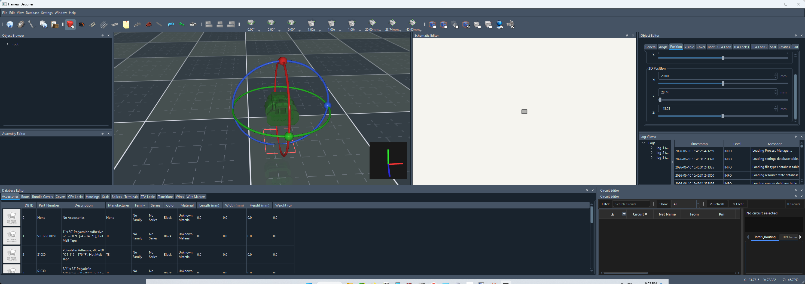
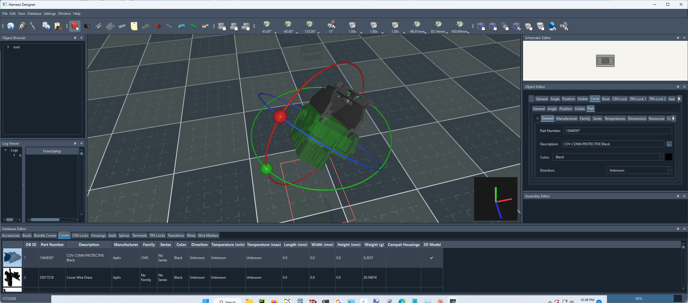
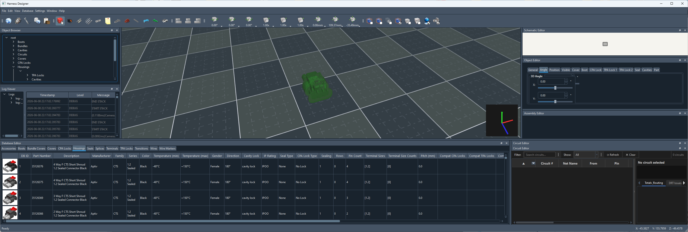

# HarnessDesigner
Wiring Harness design software (WIP)

This project is currently being developed. I don't have a time frame as to when 
it will be completed but I am hoping within the next couple of months maybe sooner.

OK so latest updates..
Did some more work on the VBO handling of the 3d models. I streamlined the process so
there is as close to a direct line from file to the GPU as I could make. The model data 
doesn't get stored in the systems RAM, it is only stored in the GPU's RAM.

What is done is the file that holds the data has a memorymapped address created for it, 
kind of like a virtual RAM address where it points to the file instead of an actual 
location in memory.

The child processes that handle the downloading of resources now handles multi seat environments.
This means that a model that is beig downloaded and converted on one client doesn't end up doing 
the same thing on the second client. Once the download and conversion is complete both clients get 
notified and the model gets loaded. The application doesn't sit there and wait for the conversion. 
The user is able to keep on working.  

WE HAVE RINGS!!!
I finally got the code for handling object rotation finished and running properly.
This was a tough thing to crack because of gimbal lock occuring when displaying angles 
to the user.

 

Here is an image of a 64 pin housing with a backshell/cover on it.

The nice thing about how I designe things is the cover is able to be selected
and positioned in place to the housing and then if the housing is moved or the angle
changed on the housing the cover moves with it keeping the orientation correct to the 
housing. This makes it easier to move the housing as an assembly with all the bits and 
pieces that are attached to it. This happens with terminals, covers, seals, cpa locks, 
tpa locks and boots. There is a dialog where the default positions can be set for the 
accessories and there is also a dialog for setting the starting orientation for the 
various parts. If done properly when adding acover to a housing it will snap right 
into position when added. I do plan on automating this process in the future so the 
first time a housing and a cover are plaed into a projec it will save the angle of 
the cover as well as the position relitive to the housing. Gotta get the application 
fully functional before adding those kinds of features. at 6 months so fat on the 
development time I don't think I am doing that bad.   

 

 

Photos of the work in progress...

 

 

Latest Additions...

OK so where I am at now...

I changed UI frameworks from wxPython to PySide6 (QT). There were too many little
glitches and things in wxPython I was not willing to contend with. It was also 
horribly slow which made is super annoying when doing things like scrolling through
70K parts in the database.

I changed the "database editor" to be more of a viewer. you cannot directly edit
in it and I have not decided if I want to add the ability to directly edit or to open
a dialog to edit. 

The database viewer now has a multi stage sorting feature. If you click on the colum n header
it will sort based on that header. click once sorts ascending clock twice and it dorts 
descending and click a third time and it turns off the sorting for that column. The multi stage part
is if you click a second column to sort and a third and so on and so forth. There is an inficator
to show the sort direction and if more than one column is being sorted there will be a number in ()'s 
after the inficator. That number is the sorting order. you can remove a sorted column that is not 
the last column in the sort order by clicking on it x times where x is the number of clicks needed to 
get to the disable click. 

I now have the first system requirement in place. The machine needs to have at least a 4 core CPU
in order to run the application. This is because of running multiple process. You have the main 
process and 3 child processes that run. The first child process looks at the database for any changes 
that may have occurred. the second process downloads images for use in the database viewer and the third 
process handles downloading the models. 

The handling of the models has changed. This change was needed because of the length of time it would take
to load and convert the models to a form that I can use with opengl. I didn't want to have
the user not be able to work while this was happening. That is the reason why this is done
in a child process. Once the model is converted the converted data gets saved to a file with the extension ".hdz"
This file is simply a zip file that contains a binary representation of numpy arrays
and it also contains a metadata file. This streamlines the loading process so no conversion
needs to be done once the file has loaded the first time around. This should make
loading a project leaps and bounds faster. 

I added a theme manager. currently there is only a dark and a light theme but user if they want can 
create their own themes and add them to the manager. Currently there is no ui to do this and it would 
need to be done via QT style sheets.

Things I still have to do...
* Assembly editor: This is used to create a fully assembled connector. This would 
include terminal pins, seals, CPA locks and TPA locks. Once an assembly is created 
it is going to be able to be used like a traditional part. The assembly will becomes 
exploded into its individual components when it gets added to a project. This allows 
the user to make adjustments in parts that are used without effecting anything else. 
* Buttons and menus: This is fairly self explaniatory.
* adding, removing and manipulating objects in the 3d editor: I have a lot of the 
framework in place and most of it should work. I need to finish up the buttons 
and menus to test it.
* adding, removing and manipulating objects in the schematic editor: This is the 
same deal as the 3d editor, most of he framework is done I simply eed to tie in 
the buttons and menus to be able to test it.
* object browser: This will provide a complete tree of all of the parts and pieces
added to a project. It is written I just have to do more tests on it. 
* object editor: This is going to be a foldable bar type of control that will provide
both iformation about a selected part and also provide the controls to set things like
the position and angle of the object.
* I have to work out a more refined control for adjusting a parts angle. Currently 
there is an arcball style control and there will be manual entry but I would also like 
to provide another mouse type control where there are handles that can be clicked 
and dragged to set the angle. The angle stuff is tricky because the eaiest way for 
a user to interact with angles is by using Euler angles (x, y and z axis) the issue
with using Euler angles is gimbal lock and the part spinning wildly when 2 of the axes
align. This only occurs when converting to Euler angles not from them. But to have the 
manual controls show the correct numbers is where we run into issues. 

Stress test rendering the following..

* 10,012,800 triangles
* 1,600 quads
* 80 solid lines
* 400 stipple lines (dashed)
* 30,044,800 vertices

There is a total of 480 housings added in this image. With the most recent changes
I have made which were to improve the performance I managed to squeeze out 
172 frames per second with the 3D editor. That is an amazing number considering
this is running using Python code. Moving around is nice and responsive and it's 
smooth as glass with ZERO chattering. I came up with a fantastic system to handle 

*Parts*
-------

There will be a database that comes preloaded with 10's of thousands of parts from 
manufcaturers like:

* Aptiv
* Bosch
* TE
* Deutsch
* Molex
* Yazaki

 

Available parts to use

* housings
* terminal pins
* cpa locks
* tpa locks
* boots
* covers
* seals & plugs
* transitions
* shrink tubing
* splices
* wires/cables

Part attributes that are available

* Wire/cable
  * part number
  * manufacturer ¹
  * description
  * family
  * series
  * color
  * max temp rating
  * image
  * datasheet
  * cad
  * additional colors (stripe colors)
  * core material
  * conductor count
  * shielding
  * turns per inch (for twisted pair)
  * conductor diameter (mm)
  * conductor area (mm2 and AWG)
  * outside diameter (mm)
  * weight (grams per meter)
* housing
  * part number
  * manufacturer ¹
  * description
  * family
  * series
  * color
  * minimum temperature
  * maximum temperature
  * image
  * datasheet
  * cad
  * gender
  * wire exit direction
  * length (mm)
  * width (mm)
  * height (mm)
  * weight (grams)
  * cavity lock type
  * sealing
  * row count
  * cavity count
  * pitch
  * compatable cpas
  * compatable tpas
  * compatable covers
  * compatable terminals
  * compatable seals
  * compatable housings (mates to)
  * 2d dxf drawing
  * 3d model (stl or 3mf)
* terminals
  * part number
  * manufacturer ¹
  * description
  * family
  * series
  * plating type
  * image
  * datasheet
  * cad
  * gender
  * sealing
  * cavity lock type
  * terminal size
  * resistance (mOhms)
  * mating cycles
  * max vibration (g)
  * max current (ma)
  * min AWG
  * max AWG
  * min dia (mm)
  * max dia (mm)
  * min cross (mm2)
  * max cross (mm2)
  * weight (grams)
* seals
  * part number
  * manufacturer ¹
  * description
  * series
  * color
  * min temperature
  * max temperature
  * image
  * datasheet
  * cad
  * type (single terminal seal, plug, etc...)
  * hardness (shore)
  * lubricated
  * length
  * outside diamneter (mm) (if applicable)
  * inside diameter (mm) (if applicable)
  * minimum wire diameter (mm)
  * maximum wire diameter (mm)
  * weight (grams)
* tpa locks
  * part number
  * manufacturer ¹
  * description
  * family
  * series
  * color
  * image
  * datasheet
  * cad
  * minimum temperature
  * maximum temperature
  * length (mm)
  * width (mm)
  * height (mm)
  * weight (grams)
  * terminal sizes
  * housing cavity locations
* cpa locks
  * part number
  * manufacturer ¹
  * description
  * family
  * series
  * color
  * image
  * datasheet
  * cad
  * minimum temperature
  * maximum temperature
  * length (mm)
  * width (mm)
  * height (mm)
  * weight (grams)
* covers
  * part number
  * manufacturer ¹
  * description
  * family
  * series
  * color
  * image
  * datasheet
  * cad
  * minimum temperature
  * maximum temperature
  * wire exit direction
  * length (mm)
  * width (mm)
  * height (mm)
  * weight (grams)
* shrink tubing
  * part number
  * manufacturer ¹
  * description
  * series
  * material
  * color
  * rigidity
  * shrink temperature
  * image
  * datasheet
  * cad
  * minimum temperature
  * maximum temperature
  * minimum diameter (mm)
  * maximum diameter (mm)
  * wall type (single, double, etc...)
  * shrink ratio
  * protections
  * adhesive
  * weight (grams)
* transitions
  *  

*Software features*
-------------------

* Schematic editor
* 3D Editor
* BOM generation
* Concentric Twisting
* 3D views of parts (when available)
* Rules
* Circuit numbering and naming
* 
