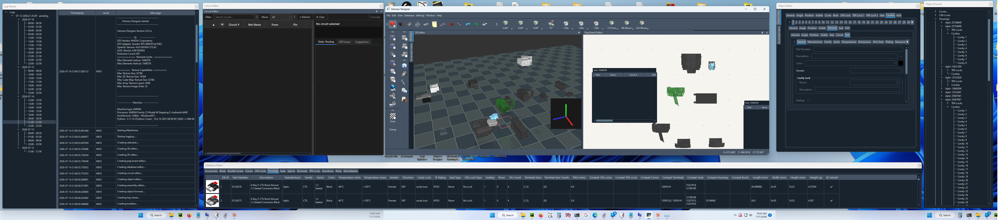
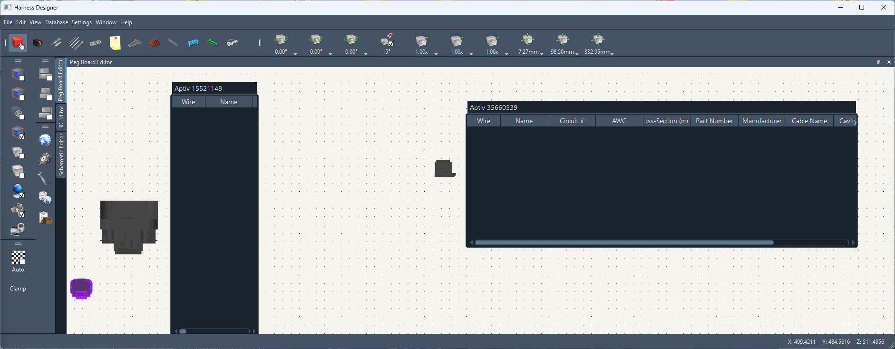

# HarnessDesigner

Wiring harness design software — currently in active development (WIP).

CAD style software for designing wiring harnesses for just about anything
you can think of. From electronics to appliances, automotive, aerospace...

This application is purpose written for designing electricl wiring harnesses it
is not a plugin for another CAD application. It doesn't have all of the features 
seen in a CAD application that can make designing a wiring harness a complicated 
process. The controls have been written specifically for working with the various 
components in a wiring harness and that is what makes it easy to use!

Pegboard view added - This view is the same thing that gets set up at the production
level when building multipls of the same woring harness. It's a flat layout with the 
harness spread out. 

---

## Screenshots

Object rotation with gimbal-lock-safe angle display:

64-pin housing with backshell/cover:

---

Recent Screenshots

New Pegboard View

---

## Features

- **Schematic editor** — full schematic design environment
- **3D editor** — real-time OpenGL rendering (see [Performance](#performance))
- **BOM generation**
- **Concentric twisting**
- **3D views of parts** (when available)
- **Rules engine**
- **Circuit numbering and naming**
- **Assembly-aware positioning** — covers, terminals, seals, CPA locks, TPA locks, and boots are parented to their housing. Moving or rotating the housing keeps all attached accessories in the correct relative position. Default accessory positions and starting orientations are configurable, so parts snap into place when added.
- **Database viewer** — multi-stage column sorting with ascending/descending/off per column and a visual sort-order indicator. Supports 70K+ parts without performance issues.
- **Theme manager** — dark and light themes built in; custom themes can be added via Qt style sheets.
- **Multi-seat support** — model downloads and conversions are shared across clients on the same network. Both clients are notified when a download completes and can continue working in the meantime.
- **Cached model format** — converted models are saved as `.hd` files, so subsequent loads require no re-conversion.
- **Pegboard View** — This view is the same thing as what you would do at the production level to build a harness.

---

## System Requirements

| Requirement | Minimum          | Recommended             |
|-------------|------------------|-------------------------|
| CPU cores   | 4 @ 2.0gHz       | 8 @ 3.0gHz              |
| GPU         | OpenGL-capable** | Nvidia Quadro RTX4000** |
| RAM         | 8 GB*            | 32 GB*                  |
| HDD/SSD     | 256GB HDD        | 1 TB SSD                |
| GPU Memory  | 2 GB*            | 8 GB*                   |  

Note: This application needs direct access to the GPU hardware in order to run
      so it will not work in a virtual environment.

*This application is cross platform and will run on Windows, MacOS (ARM) and 
 Linux. On systems thathave shared memory for the GPU take that into account
 when running the application. You will need to have ample shared memory
 between the display adapter and the system in order to run properly.

**OpenGL version 3.3 is the minimum that is required to run. MacOS has deprecated
  the use of OpenGL but it is still available in the OS. It will be removed in 
  the future.

---

## Parts Database

The application ships with a database preloaded with tens of thousands of parts from:

- Aptiv
- Bosch
- TE
- Deutsch
- Molex
- Yazaki

### Available Part Types

- Housings
- Terminal pins
- CPA locks
- TPA locks
- Boots
- Covers
- Seals & plugs
- Transitions
- Shrink tubing
- Splices
- Wires/cables

### Part Attributes

* Wire/cable
  * part number
  * manufacturer ¹
  * description
  * family
  * series
  * color
  * max temp rating
  * image
  * datasheet
  * cad
  * additional colors (stripe colors)
  * core material
  * conductor count
  * shielding
  * turns per inch (for twisted pair)
  * conductor diameter (mm)
  * conductor area (mm² and AWG)
  * outside diameter (mm)
  * weight (grams per meter)
* Housing
  * part number
  * manufacturer ¹
  * description
  * family
  * series
  * color
  * minimum temperature
  * maximum temperature
  * image
  * datasheet
  * cad
  * gender
  * wire exit direction
  * length (mm)
  * width (mm)
  * height (mm)
  * weight (grams)
  * cavity lock type
  * sealing
  * row count
  * cavity count
  * pitch
  * compatible CPAs
  * compatible TPAs
  * compatible covers
  * compatible terminals
  * compatible seals
  * compatible housings (mates to)
  * 2D DXF drawing
  * 3D model (STL or 3MF)
* Terminals
  * part number
  * manufacturer ¹
  * description
  * family
  * series
  * plating type
  * image
  * datasheet
  * cad
  * gender
  * sealing
  * cavity lock type
  * terminal size
  * resistance (mΩ)
  * mating cycles
  * max vibration (g)
  * max current (mA)
  * min AWG
  * max AWG
  * min dia (mm)
  * max dia (mm)
  * min cross (mm²)
  * max cross (mm²)
  * weight (grams)
* Seals
  * part number
  * manufacturer ¹
  * description
  * series
  * color
  * min temperature
  * max temperature
  * image
  * datasheet
  * cad
  * type (single terminal seal, plug, etc.)
  * hardness (Shore)
  * lubricated
  * length
  * outside diameter (mm) (if applicable)
  * inside diameter (mm) (if applicable)
  * minimum wire diameter (mm)
  * maximum wire diameter (mm)
  * weight (grams)
* TPA locks
  * part number
  * manufacturer ¹
  * description
  * family
  * series
  * color
  * image
  * datasheet
  * cad
  * minimum temperature
  * maximum temperature
  * length (mm)
  * width (mm)
  * height (mm)
  * weight (grams)
  * terminal sizes
  * housing cavity locations
* CPA locks
  * part number
  * manufacturer ¹
  * description
  * family
  * series
  * color
  * image
  * datasheet
  * cad
  * minimum temperature
  * maximum temperature
  * length (mm)
  * width (mm)
  * height (mm)
  * weight (grams)
* Covers
  * part number
  * manufacturer ¹
  * description
  * family
  * series
  * color
  * image
  * datasheet
  * cad
  * minimum temperature
  * maximum temperature
  * wire exit direction
  * length (mm)
  * width (mm)
  * height (mm)
  * weight (grams)
* Shrink tubing
  * part number
  * manufacturer ¹
  * description
  * series
  * material
  * color
  * rigidity
  * shrink temperature
  * image
  * datasheet
  * cad
  * minimum temperature
  * maximum temperature
  * minimum diameter (mm)
  * maximum diameter (mm)
  * wall type (single, double, etc.)
  * shrink ratio
  * protections
  * adhesive
  * weight (grams)
* Transitions

¹ Manufacturer field links to manufacturer record.

---

## Roadmap

- [ ] **Assembly editor** — build a fully assembled connector (housing + terminal pins + seals + CPA/TPA locks) as a reusable part. When added to a project the assembly explodes into individual components, letting the user adjust each part independently without affecting other assemblies.
- [x] **Buttons and menus** — toolbar and menu wiring for all existing editor actions.
- [x] **3D editor object manipulation** — add, remove, and manipulate objects (framework is in place; pending buttons/menus).
- [ ] **Schematic editor object manipulation** — same as above for the schematic editor.
- [x] **Object browser** — project tree showing all parts and assemblies (written; needs further testing).
- [x] **Object editor** — collapsible panel showing properties and controls (position, angle, etc.) for the selected object.
- [x] **Refined angle control** — supplement the existing arcball and manual-entry controls with a handle-based drag control. The challenge is presenting Euler angles (X/Y/Z) to the user without hitting gimbal lock during display.

---

## Performance

Stress test scene:

| Primitive | Count |
|-----------|-------|
| Triangles | 10,012,800 |
| Quads | 1,600 |
| Solid lines | 80 |
| Stipple lines | 400 |
| Vertices | 30,044,800 |

480 housings rendered at **172 FPS** in the 3D editor, running in Python.
